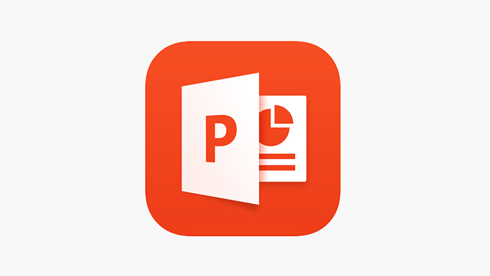
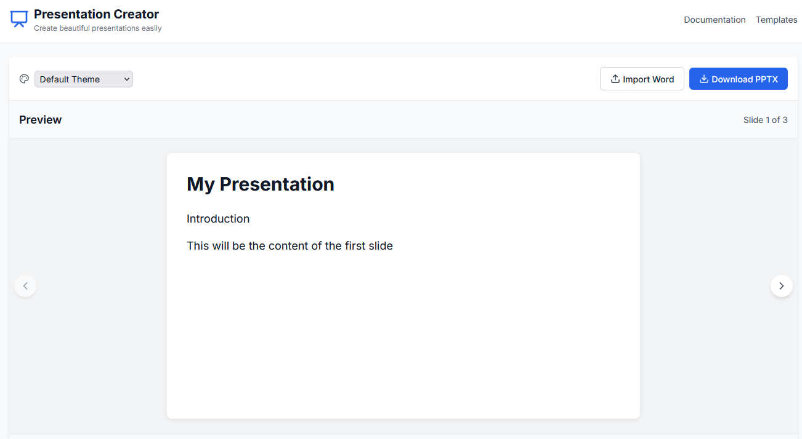
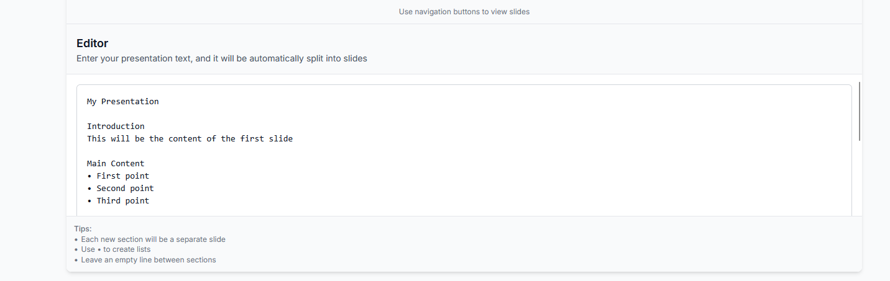

# Website for Creating Presentations

A modern web application for creating and managing beautiful presentations online. Built with cutting-edge technologies to provide a seamless and intuitive presentation creation experience.



## 📸 Screenshots


*Main dashboard view*


*Presentation editor interface*

## �� Technologies Used

- React
- TypeScript
- Vite
- Tailwind CSS
- ESLint for code quality
- PostCSS

## ✨ Features

- Modern and intuitive user interface
- Real-time presentation editing
- Responsive design
- TypeScript for enhanced code reliability
- Fast development experience with Vite
- Beautiful styling with Tailwind CSS

## 🛠️ Installation

1. Clone the repository:
```bash
git clone https://github.com/Justhateme0/Website-for-creating-presentations
```

2. Install dependencies:
```bash
npm install
```

3. Start the development server:
```bash
npm run dev
```

## 🔧 Available Scripts

- `npm run dev` - Starts the development server
- `npm run build` - Builds the app for production
- `npm run lint` - Runs ESLint to check code quality
- `npm run preview` - Preview the production build locally

## 📝 Project Structure

```
├── src/              # Source files
├── public/           # Static files
├── index.html        # Entry HTML file
├── vite.config.ts    # Vite configuration
├── tailwind.config.js # Tailwind CSS configuration
└── tsconfig.json     # TypeScript configuration
```

## 🤝 Contributing

Contributions, issues, and feature requests are welcome! Feel free to check the issues page.

---

Made with ❤️ using modern web technologies 
